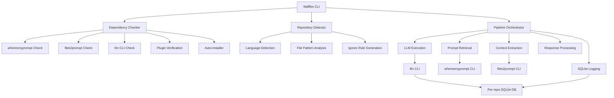

# Waffles Application Design Document

## Executive Summary

**Waffles** is a command-line tool that orchestrates an LLM toolchain for local development workflows. It automates the process of gathering project context, retrieving prompts, and executing LLM queries while maintaining comprehensive logging for transparency.

The application name "Waffles" comes from Shrek: "in the morning I'm making waffles" - representing the automated morning workflow of preparing and executing LLM interactions.

## System Overview

### Core Purpose
- **Tool Integration**: Ensure LLM toolchain is installed and operational
- **Context Gathering**: Auto-detect project structure and extract relevant files
- **Prompt Orchestration**: Retrieve system prompts and combine with project context
- **LLM Execution**: Execute LLM queries with structured input pipeline
- **Comprehensive Logging**: Store all inputs and outputs to SQLite for transparency

### Key Design Decisions
1. **Installation Strategy**: Offer both auto-install (`--install` flag) and manual installation guidance
2. **Model Support**: Single model execution with easy switching via `--model` flag
3. **Database Strategy**: Per-repository SQLite databases (`llm-logs.sqlite`) for project isolation
4. **Architecture**: Modular Go application using Cobra CLI framework with environment-based configuration

## External Tool Integration

### Dependencies
- **[wheresmyprompt](https://github.com/toozej/wheresmyprompt)**: Go-based prompt retrieval from StandardNotes or local files
- **[files2prompt](https://github.com/toozej/files2prompt)**: Go-based context extraction from project files
- **[llm](https://github.com/simonw/llm)**: Python-based LLM CLI with SQLite logging

### Required LLM Plugins
- **Providers**: `llm-anthropic`, `llm-ollama`, `llm-gemini`
- **Utilities**: `llm-jq`, `llm-fragments-github`, `llm-fragments-go`, `llm-commit`

## System Architecture



### Core Components

#### 1. Dependency Management (`../pkg/deps/`)
- **Binary Detection**: Check existence of required tools in PATH
- **Version Verification**: Ensure minimum compatible versions
- **Plugin Validation**: Verify LLM plugins are installed
- **Auto-Installation**: Download/install missing dependencies with user consent
- **Installation Guidance**: Provide clear instructions when auto-install unavailable

#### 2. Repository Analysis (`../pkg/repo/`)
- **Language Detection**: Analyze project structure to determine primary language
- **File Pattern Matching**: Generate appropriate file filters for different project types
- **Ignore Rule Generation**: Create context-aware ignore patterns
- **Supported Languages**:
  - **Go**: Include `*.go` files, exclude `*_test.go`, `pkg/` packages
  - **Python**: Include `*.py` files, exclude tests, `__init__.py`
  - **Extensible**: Plugin architecture for additional language support

#### 3. Pipeline Orchestration (`../pkg/pipeline/`)
- **Sequential Execution**: Manage tool execution workflow
- **Error Handling**: Graceful degradation and informative error messages
- **Output Coordination**: Pipe outputs between tools
- **Performance Optimization**: Concurrent operations where safe

#### 4. Configuration Management (`../pkg/config/`)
- **Environment Variables**: Support for `.env` files and system environment
- **CLI Flags**: Command-line overrides for all major options
- **Profile Support**: Named configuration profiles for different workflows
- **Tool-specific Passthrough**: Direct flag/argument forwarding to external tools

#### 5. Logging System (`../pkg/logging/`)
- **SQLite Integration**: Leverage llm's native SQLite logging
- **Structured Logging**: Comprehensive input/output tracking
- **Query Interface**: Built-in query capabilities for logged data
- **Export Functions**: Support for various export formats

## Repository Auto-Detection Logic

### Detection Algorithm
1. **File System Analysis**: Scan for language-specific indicators
2. **Dependency Files**: Analyze `go.mod`, `requirements.txt`, `package.json`, etc.
3. **Directory Structures**: Recognize common project layouts
4. **File Extensions**: Statistical analysis of file type distribution

### Language-Specific Rules

#### Go Projects
```bash
# Detection Criteria
- Presence of go.mod file
- *.go files in root or cmd/ directory
- Typical Go directory structure (cmd/, internal/, pkg/)

# File Inclusion Rules
- Include: *.go files
- Exclude: *_test.go, pkg/version/*, pkg/man/*
- Special handling for vendor/ and internal/ directories
```

#### Python Projects
```bash
# Detection Criteria
- Presence of requirements.txt, pyproject.toml, or setup.py
- *.py files with typical Python project structure
- __pycache__ directories

# File Inclusion Rules
- Include: *.py files
- Exclude: *test*.py, __init__.py, __pycache__/
- Special handling for virtual environments
```

### Override Mechanisms
- **`--language` Flag**: Force specific language detection
- **`--files2prompt-args`**: Direct argument passthrough
- **`--include/--exclude`**: Manual file pattern specification

## SQLite Database Schema

### Database Location
- **Path**: `./llm-logs.sqlite` (in current working directory)
- **Isolation**: One database per repository/project
- **Integration**: Leverages llm CLI's native logging capabilities

### Schema Design (Extended from llm CLI)
```sql
-- Core llm CLI tables (maintained by llm)
CREATE TABLE conversations (id TEXT PRIMARY KEY, name TEXT, created INTEGER);
CREATE TABLE messages (id TEXT PRIMARY KEY, conversation_id TEXT, role TEXT, content TEXT, created INTEGER);
CREATE TABLE responses (id TEXT PRIMARY KEY, model TEXT, prompt TEXT, response TEXT, created INTEGER);

-- Waffles-specific extensions
CREATE TABLE waffles_executions (
    id TEXT PRIMARY KEY,
    conversation_id TEXT,
    command_args TEXT,
    wheresmyprompt_query TEXT,
    files2prompt_args TEXT,
    detected_language TEXT,
    file_count INTEGER,
    execution_time_ms INTEGER,
    created INTEGER,
    FOREIGN KEY (conversation_id) REFERENCES conversations(id)
);

CREATE TABLE waffles_files (
    id TEXT PRIMARY KEY,
    execution_id TEXT,
    file_path TEXT,
    file_size INTEGER,
    included BOOLEAN,
    exclusion_reason TEXT,
    FOREIGN KEY (execution_id) REFERENCES waffles_executions(id)
);
```

## CLI Interface Specification

### Primary Command Structure
```bash
waffles [options] [prompt-search-terms...]
```

### Core Flags
```bash
# Model and Provider Options
--model, -m          LLM model to use (default: from config)
--provider          LLM provider override

# Tool Configuration  
--wheresmyprompt-args    Pass arguments directly to wheresmyprompt
--files2prompt-args      Pass arguments directly to files2prompt  
--llm-args              Pass arguments directly to llm CLI

# Repository Options
--language          Override auto-detected language
--include           Additional file patterns to include
--exclude           File patterns to exclude
--ignore-gitignore  Don't respect .gitignore rules

# Installation and Setup
--install           Auto-install missing dependencies
--check-deps        Only check dependencies, don't execute
--setup             Interactive setup wizard

# Output and Logging
--output, -o        Output file (default: stdout)
--log-db           SQLite database path (default: ./llm-logs.sqlite)
--quiet, -q         Suppress progress output
--verbose, -v       Detailed execution logging

# Configuration
--config            Configuration file path
--profile           Named configuration profile
```

### Subcommands
```bash
waffles deps        # Dependency management
waffles setup       # Interactive setup
waffles query       # Query logged conversations
waffles export      # Export logged data
waffles version     # Version information
waffles man         # Generate man pages
```

### Usage Examples
```bash
# Basic usage with auto-detection
waffles "code review" "golang best practices"

# Override language detection
waffles --language python "refactor this code"

# Pass specific arguments to tools
waffles --files2prompt-args="--ignore vendor/" "document this API"

# Setup and dependency management
waffles --install deps check
waffles setup --interactive

# Query logged conversations
waffles query --since "2024-01-01" --model "gpt-4"
```

## Configuration Management

### Configuration Sources (Priority Order)
1. Command-line flags (highest priority)
2. Environment variables
3. Configuration file (`.waffles.yml`)
4. Built-in defaults (lowest priority)

### Configuration File Format
```yaml
# .waffles.yml
default_model: "claude-3-sonnet"
default_provider: "anthropic"

# Tool configurations
wheresmyprompt:
  default_args: ["-o"]
  prompt_source: "standardnotes"  # or "local"
  local_file: "~/prompts.md"

files2prompt:
  default_args: ["--ignore-gitignore"]
  custom_ignores:
    - "*.tmp"
    - "build/"

llm:
  default_args: ["--system"]
  plugins_required:
    - "llm-anthropic"
    - "llm-gemini"

# Language-specific overrides
languages:
  go:
    include_patterns: ["*.go"]
    exclude_patterns: ["*_test.go", "pkg/version/*"]
  python:
    include_patterns: ["*.py"] 
    exclude_patterns: ["*test*.py", "__init__.py"]

# Profiles for different workflows
profiles:
  code_review:
    model: "claude-3-sonnet"
    wheresmyprompt_args: ["-s", "code review"]
    
  documentation:
    model: "gpt-4"
    wheresmyprompt_args: ["-s", "documentation"]
```

### Environment Variables
```bash
WAFFLES_DEFAULT_MODEL=claude-3-sonnet
WAFFLES_LOG_DB_PATH=./custom-logs.sqlite
WAFFLES_CONFIG_PATH=~/.config/waffles/config.yml

# Tool-specific environment variables
WHERESMYPROMPT_ARGS="-o"
FILES2PROMPT_ARGS="--ignore-gitignore" 
LLM_ARGS="--system"
```

## Error Handling and Edge Cases

### Dependency Issues
- **Missing Tools**: Clear installation instructions with auto-install option
- **Version Incompatibility**: Specific version requirements and upgrade guidance
- **Plugin Issues**: Individual plugin verification with installation commands

### Repository Analysis Failures
- **Unrecognized Languages**: Fallback to manual configuration
- **Mixed Projects**: Prioritization algorithm with user override options
- **Empty Repositories**: Graceful handling with informative messages

### Tool Execution Failures
- **wheresmyprompt Failures**: Fallback to manual prompt input
- **files2prompt Failures**: Manual file specification options
- **LLM CLI Failures**: Detailed error propagation with suggested fixes

### Data and Logging Issues
- **SQLite Database Corruption**: Backup and recovery procedures
- **Disk Space Issues**: Configurable log retention policies
- **Permission Issues**: Clear guidance on file system requirements

## Implementation Roadmap

### Phase 1: Foundation (Weeks 1-2)
- [ ] Basic CLI structure with Cobra
- [ ] Configuration management system
- [ ] Dependency detection and verification
- [ ] Simple tool execution pipeline

### Phase 2: Core Features (Weeks 3-4)
- [ ] Repository auto-detection logic
- [ ] Tool integration (wheresmyprompt, files2prompt, llm)
- [ ] SQLite logging system
- [ ] Error handling and recovery

### Phase 3: Advanced Features (Weeks 5-6)
- [ ] Auto-installation system
- [ ] Configuration profiles
- [ ] Query and export capabilities
- [ ] Comprehensive testing suite

### Phase 4: Polish and Documentation (Week 7)
- [ ] User documentation
- [ ] Performance optimization

## Security Considerations

### API Key Management
- **Environment Variables**: Secure handling of LLM provider API keys
- **Configuration Files**: Encrypted storage options
- **Key Rotation**: Support for key updates without service interruption

### Data Privacy
- **Local Storage**: All data remains on user's machine
- **SQLite Encryption**: Optional database encryption
- **Sensitive Data Filtering**: Configurable patterns to exclude sensitive information

### Tool Execution Safety
- **Input Validation**: Sanitize all user inputs passed to external tools
- **Command Injection Prevention**: Parameterized execution of external commands
- **Resource Limits**: Configurable limits on file processing and execution time

## Performance Considerations

### Optimization Strategies
- **Concurrent Processing**: Parallel execution where safe
- **Caching**: Intelligent caching of repository analysis results
- **Incremental Processing**: Only process changed files when possible
- **Resource Management**: Configurable limits on memory and disk usage

### Scalability
- **Large Repositories**: Efficient handling of repositories with thousands of files
- **Long-running Operations**: Progress indication and cancellation support
- **Database Growth**: Automatic cleanup and archival of old logs

---

*This design document serves as the architectural foundation for the Waffles application. Implementation details may evolve during development based on testing and user feedback.*