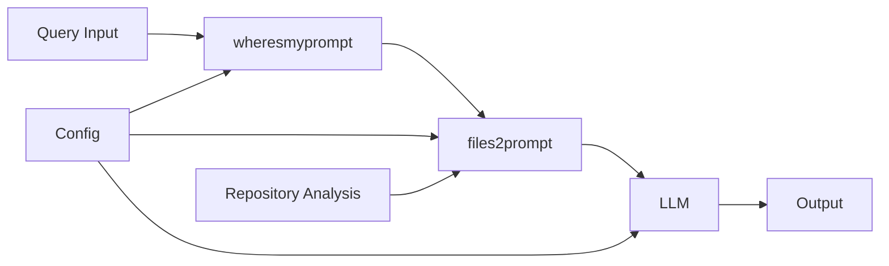

# Waffles - LLM Toolchain Orchestrator


[](https://goreportcard.com/report/github.com/toozej/waffles)


**Waffles** is a command-line tool that orchestrates an LLM toolchain for local development workflows. It automates the process of gathering project context, retrieving prompts, and executing LLM queries, making AI-assisted development more efficient and consistent. Waffles should be pronounced with a Donkey from Shrek accent.

## Features

- **Automated Pipeline Orchestration**: Seamlessly chains `wheresmyprompt` → `files2prompt` → `llm` for complete workflow automation
- **Intelligent Repository Analysis**: Detects project language, analyzes file structure, and applies smart filtering
- **Dependency Management**: Automatic installation and verification of required tools
- **Interactive Setup**: Guided configuration wizard for first-time setup
- **Execution History**: Persistent logging and querying of all pipeline executions
- **Export Capabilities**: Multiple output formats (JSON, CSV, Markdown, SQL) for data analysis
- **Flexible Configuration**: Environment-based configuration with per-project overrides

## Quick Start

### Installation

```bash
# Using Homebrew (recommended)
brew install toozej/tap/waffles

# Using Go
go install github.com/toozej/waffles/cmd/waffles@latest

# From source
git clone https://github.com/toozej/waffles.git
cd waffles
make install
```

### First Run Setup

```bash
# Interactive setup wizard
waffles setup

# Or setup with auto-installation
waffles setup --auto-install
```

### Basic Usage

```bash
# Execute a simple query
waffles query "explain this code structure"

# Query with specific model
waffles query --model gpt-4 "review this code for security issues"

# Export execution history
waffles export --format json --output results.json
```

## Table of Contents

1. [Installation Guide](installation.md)
2. [Usage Guide](usage.md)
3. [Configuration](configuration.md)
4. [Commands Reference](commands.md)
5. [Troubleshooting](troubleshooting.md)
6. [Examples](examples.md)

## Core Workflow

Waffles orchestrates a three-step pipeline:

1. **wheresmyprompt**: Retrieves system prompts and context
2. **files2prompt**: Extracts relevant project files and context
3. **llm**: Executes the LLM query with combined context



## Key Benefits

- **Consistency**: Standardized workflow ensures consistent results across projects
- **Efficiency**: Automated context gathering saves time and reduces errors
- **History**: Track all executions with detailed logging and analytics
- **Flexibility**: Customizable for different project types and requirements
- **Integration**: Works with existing development workflows and tools

## Requirements

### Required Dependencies

- **wheresmyprompt**: System prompt retrieval tool
- **files2prompt**: File context extraction tool  
- **llm**: LLM CLI interface

### Optional Dependencies

- **1Password CLI**: For secure credential management (if using 1Password integration)

All dependencies can be automatically installed during setup.

## Quick Examples

### Basic Query
```bash
waffles query "What does this codebase do?"
```

### Custom File Patterns
```bash
waffles query --include "*.go,*.md" --exclude "vendor/*" "Analyze the Go code"
```

### Different Models
```bash
waffles query --model claude-3-sonnet "Review for performance issues"
waffles query --model gpt-4 "Suggest architectural improvements"
```

### Export Results
```bash
# Export as JSON
waffles export --format json --filter "language=go" --output go-queries.json

# Export as CSV for analysis
waffles export --format csv --days 7 --output weekly-usage.csv
```

## Documentation

- **[Installation Guide](./docs/installation.md)**: Detailed installation instructions for all platforms
- **[Usage Guide](./docs/usage.md)**: Comprehensive usage examples and best practices  
- **[Configuration](./docs/configuration.md)**: Configuration options and environment variables
- **[Commands Reference](./docs/commands.md)**: Complete command reference with all options
- **[Troubleshooting](./docs/troubleshooting.md)**: Common issues and solutions
- **[Examples](./docs/examples.md)**: Real-world usage examples

## Support

- **Issues**: [GitHub Issues](https://github.com/toozej/waffles/issues)
- **Discussions**: [GitHub Discussions](https://github.com/toozej/waffles/discussions)
- **Documentation**: [docs/](https://github.com/toozej/waffles/tree/main/docs)

## License

See [LICENSE](./LICENSE) for details.

## Contributing

Contributions are welcome! Please see [CONTRIBUTING.md](./docs/development/contributing.md) for guidelines.