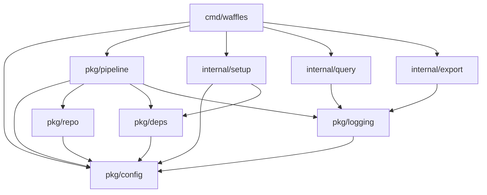

# Internal API Reference

This document provides comprehensive reference documentation for Waffles' internal APIs, interfaces, and core types.

## Table of Contents

- [Package Overview](#package-overview)
- [Configuration API](#configuration-api)
- [Pipeline API](#pipeline-api)
- [Repository Analysis API](#repository-analysis-api)
- [Dependency Management API](#dependency-management-api)
- [Database and Logging API](#database-and-logging-api)
- [Query and Export API](#query-and-export-api)
- [Setup and Installation API](#setup-and-installation-api)
- [Error Types](#error-types)
- [Interfaces](#interfaces)
- [Utility APIs](#utility-apis)

## Package Overview

### Core Packages

- [`pkg/config`](#configuration-api) - Configuration loading and validation
- [`pkg/pipeline`](#pipeline-api) - LLM toolchain orchestration
- [`pkg/repo`](#repository-analysis-api) - Repository analysis and language detection
- [`pkg/deps`](#dependency-management-api) - Dependency detection and installation
- [`pkg/logging`](#database-and-logging-api) - Database operations and execution logging
- [`internal/query`](#query-and-export-api) - Query processing engine
- [`internal/export`](#query-and-export-api) - Data export functionality
- [`internal/setup`](#setup-and-installation-api) - Interactive setup wizard

### Package Dependencies



## Configuration API

### Types

#### Config

```go
// Config holds all configuration settings for Waffles
type Config struct {
    // LLM Configuration
    DefaultModel    string `env:"WAFFLES_DEFAULT_MODEL"`
    DefaultProvider string `env:"WAFFLES_DEFAULT_PROVIDER"`
    
    // Pipeline Configuration
    Timeout          int    `env:"WAFFLES_TIMEOUT"`
    MaxRetries       int    `env:"WAFFLES_MAX_RETRIES"`
    RetryDelay       int    `env:"WAFFLES_RETRY_DELAY"`
    
    // Database Configuration
    LogDBPath        string `env:"WAFFLES_LOG_DB_PATH"`
    EnableLogging    bool   `env:"WAFFLES_ENABLE_LOGGING"`
    
    // Repository Configuration
    IgnorePatterns   []string `env:"WAFFLES_IGNORE_PATTERNS"`
    MaxFileSize      int64    `env:"WAFFLES_MAX_FILE_SIZE"`
    
    // Tool Configuration
    WheresmypromptPath string `env:"WAFFLES_WHERESMYPROMPT_PATH"`
    Files2promptPath   string `env:"WAFFLES_FILES2PROMPT_PATH"`
    LLMPath           string `env:"WAFFLES_LLM_PATH"`
}
```

### Functions

#### LoadConfig

```go
func LoadConfig() (*Config, error)
```

Loads configuration from environment variables with default values.

**Returns:**
- `*Config` - Loaded configuration
- `error` - Configuration loading error

**Example:**
```go
cfg, err := config.LoadConfig()
if err != nil {
    log.Fatalf("Failed to load config: %v", err)
}
```

#### LoadConfigFromFile

```go
func LoadConfigFromFile(path string) (*Config, error)
```

Loads configuration from a .env file.

**Parameters:**
- `path` - Path to .env file

**Returns:**
- `*Config` - Loaded configuration
- `error` - File loading or parsing error

#### Validate

```go
func (c *Config) Validate() error
```

Validates configuration settings.

**Returns:**
- `error` - Validation error if invalid

**Validation Rules:**
- `DefaultModel` must not be empty
- `DefaultProvider` must not be empty
- `Timeout` must be > 0
- `MaxRetries` must be >= 0
- `LogDBPath` must be writable if logging enabled

### Error Types

```go
var (
    ErrMissingModel    = errors.New("default model not specified")
    ErrMissingProvider = errors.New("default provider not specified")
    ErrInvalidTimeout  = errors.New("timeout must be greater than 0")
    ErrInvalidPath     = errors.New("invalid file path")
)
```

## Pipeline API

### Types

#### Pipeline

```go
// Pipeline orchestrates the execution of the LLM toolchain
type Pipeline struct {
    config   *config.Config
    database *logging.Database
    repo     repo.Analyzer
    deps     deps.Manager
}
```

#### ExecutionContext

```go
// ExecutionContext holds information about a pipeline execution
type ExecutionContext struct {
    ID            string                 `json:"id"`
    Query         string                `json:"query"`
    StartTime     time.Time             `json:"start_time"`
    EndTime       *time.Time            `json:"end_time,omitempty"`
    Duration      time.Duration         `json:"duration"`
    Success       bool                  `json:"success"`
    Error         string                `json:"error,omitempty"`
    Steps         []StepContext         `json:"steps"`
    Metadata      map[string]interface{} `json:"metadata"`
}
```

#### StepContext

```go
// StepContext holds information about a single pipeline step
type StepContext struct {
    Name        string                 `json:"name"`
    StartTime   time.Time             `json:"start_time"`
    EndTime     *time.Time            `json:"end_time,omitempty"`
    Duration    time.Duration         `json:"duration"`
    Success     bool                  `json:"success"`
    Input       string                `json:"input"`
    Output      string                `json:"output"`
    Error       string                `json:"error,omitempty"`
    Metadata    map[string]interface{} `json:"metadata"`
}
```

### Functions

#### NewPipeline

```go
func NewPipeline(cfg *config.Config, db *logging.Database) *Pipeline
```

Creates a new pipeline instance.

**Parameters:**
- `cfg` - Configuration settings
- `db` - Database connection for logging

**Returns:**
- `*Pipeline` - New pipeline instance

#### Execute

```go
func (p *Pipeline) Execute(ctx context.Context, query string) (*ExecutionContext, error)
```

Executes the complete LLM toolchain with the given query.

**Parameters:**
- `ctx` - Context for cancellation and timeout
- `query` - User query to process

**Returns:**
- `*ExecutionContext` - Execution details and results
- `error` - Execution error

**Workflow:**
1. Repository analysis using wheresmyprompt
2. File processing with files2prompt  
3. LLM query execution
4. Result aggregation and logging

#### ValidateDependencies

```go
func (p *Pipeline) ValidateDependencies(ctx context.Context) error
```

Validates that all required tools are available and functional.

**Parameters:**
- `ctx` - Context for timeout

**Returns:**
- `error` - Validation error if dependencies missing or non-functional

## Repository Analysis API

### Types

#### Analyzer

```go
// Analyzer performs repository analysis and file discovery
type Analyzer struct {
    config   *config.Config
    detector *LanguageDetector
}
```

#### RepositoryInfo

```go
// RepositoryInfo contains analysis results for a repository
type RepositoryInfo struct {
    Path         string            `json:"path"`
    Languages    map[string]int    `json:"languages"`
    FileCount    int               `json:"file_count"`
    TotalSize    int64             `json:"total_size"`
    Files        []FileInfo        `json:"files"`
    GitInfo      *GitInfo          `json:"git_info,omitempty"`
}
```

#### FileInfo

```go
// FileInfo contains information about a single file
type FileInfo struct {
    Path         string            `json:"path"`
    RelativePath string            `json:"relative_path"`
    Size         int64             `json:"size"`
    Language     string            `json:"language"`
    Extension    string            `json:"extension"`
    IsText       bool              `json:"is_text"`
    Metadata     map[string]string `json:"metadata"`
}
```

#### GitInfo

```go
// GitInfo contains Git repository information
type GitInfo struct {
    IsRepo      bool   `json:"is_repo"`
    Branch      string `json:"branch,omitempty"`
    Commit      string `json:"commit,omitempty"`
    RemoteURL   string `json:"remote_url,omitempty"`
    IsDirty     bool   `json:"is_dirty"`
}
```

### Functions

#### NewAnalyzer

```go
func NewAnalyzer(cfg *config.Config) *Analyzer
```

Creates a new repository analyzer.

**Parameters:**
- `cfg` - Configuration settings

**Returns:**
- `*Analyzer` - New analyzer instance

#### Analyze

```go
func (a *Analyzer) Analyze(path string) (*RepositoryInfo, error)
```

Analyzes a repository and returns comprehensive information.

**Parameters:**
- `path` - Path to repository root

**Returns:**
- `*RepositoryInfo` - Analysis results
- `error` - Analysis error

#### GetRelevantFiles

```go
func (a *Analyzer) GetRelevantFiles(path string, query string) ([]FileInfo, error)
```

Gets files relevant to a specific query using intelligent filtering.

**Parameters:**
- `path` - Repository path
- `query` - User query for context

**Returns:**
- `[]FileInfo` - Relevant files
- `error` - Analysis error

#### DetectLanguage

```go
func (d *LanguageDetector) DetectLanguage(filename string) string
```

Detects programming language based on file extension and content.

**Parameters:**
- `filename` - File name or path

**Returns:**
- `string` - Detected language (e.g., "go", "javascript", "python")

## Dependency Management API

### Types

#### Manager

```go
// Manager handles dependency detection and installation
type Manager struct {
    config    *config.Config
    detector  *Detector
    installer *Installer
}
```

#### Dependency

```go
// Dependency represents a required tool or library
type Dependency struct {
    Name        string   `json:"name"`
    Version     string   `json:"version,omitempty"`
    Required    bool     `json:"required"`
    Installed   bool     `json:"installed"`
    Path        string   `json:"path,omitempty"`
    Commands    []string `json:"commands"`
    InstallURL  string   `json:"install_url,omitempty"`
}
```

#### InstallationResult

```go
// InstallationResult contains the result of a dependency installation
type InstallationResult struct {
    Dependency *Dependency `json:"dependency"`
    Success    bool        `json:"success"`
    Error      string      `json:"error,omitempty"`
    Path       string      `json:"path,omitempty"`
    Duration   time.Duration `json:"duration"`
}
```

### Functions

#### NewManager

```go
func NewManager(cfg *config.Config) *Manager
```

Creates a new dependency manager.

**Parameters:**
- `cfg` - Configuration settings

**Returns:**
- `*Manager` - New manager instance

#### DetectDependencies

```go
func (m *Manager) DetectDependencies() ([]Dependency, error)
```

Detects all required dependencies and their installation status.

**Returns:**
- `[]Dependency` - List of dependencies with status
- `error` - Detection error

#### InstallDependency

```go
func (m *Manager) InstallDependency(dep *Dependency) (*InstallationResult, error)
```

Installs a specific dependency.

**Parameters:**
- `dep` - Dependency to install

**Returns:**
- `*InstallationResult` - Installation result
- `error` - Installation error

#### InstallAll

```go
func (m *Manager) InstallAll() ([]InstallationResult, error)
```

Installs all missing dependencies.

**Returns:**
- `[]InstallationResult` - Results for all installations
- `error` - Overall installation error

## Database and Logging API

### Types

#### Database

```go
// Database handles SQLite operations for execution logging
type Database struct {
    conn *sql.DB
    path string
}
```

#### ExecutionLog

```go
// ExecutionLog represents a logged pipeline execution
type ExecutionLog struct {
    ID          int64                  `json:"id" db:"id"`
    ExecutionID string                 `json:"execution_id" db:"execution_id"`
    Query       string                 `json:"query" db:"query"`
    Success     bool                   `json:"success" db:"success"`
    Duration    int64                  `json:"duration_ms" db:"duration_ms"`
    Error       string                 `json:"error,omitempty" db:"error"`
    CreatedAt   time.Time             `json:"created_at" db:"created_at"`
    Metadata    map[string]interface{} `json:"metadata" db:"metadata"`
}
```

#### StepLog

```go
// StepLog represents a logged pipeline step
type StepLog struct {
    ID          int64                  `json:"id" db:"id"`
    ExecutionID string                 `json:"execution_id" db:"execution_id"`
    StepName    string                 `json:"step_name" db:"step_name"`
    Success     bool                   `json:"success" db:"success"`
    Duration    int64                  `json:"duration_ms" db:"duration_ms"`
    Input       string                 `json:"input" db:"input"`
    Output      string                 `json:"output" db:"output"`
    Error       string                 `json:"error,omitempty" db:"error"`
    CreatedAt   time.Time             `json:"created_at" db:"created_at"`
}
```

### Functions

#### NewDatabase

```go
func NewDatabase(dbPath string) (*Database, error)
```

Creates a new database connection and initializes schema.

**Parameters:**
- `dbPath` - Path to SQLite database file (use ":memory:" for in-memory)

**Returns:**
- `*Database` - New database instance
- `error` - Connection or initialization error

#### LogExecution

```go
func (db *Database) LogExecution(ctx *pipeline.ExecutionContext) error
```

Logs a complete pipeline execution.

**Parameters:**
- `ctx` - Execution context to log

**Returns:**
- `error` - Logging error

#### GetExecutions

```go
func (db *Database) GetExecutions(limit, offset int) ([]ExecutionLog, error)
```

Retrieves execution logs with pagination.

**Parameters:**
- `limit` - Maximum number of records
- `offset` - Number of records to skip

**Returns:**
- `[]ExecutionLog` - Execution logs
- `error` - Query error

#### GetExecutionsByQuery

```go
func (db *Database) GetExecutionsByQuery(query string) ([]ExecutionLog, error)
```

Searches executions by query text.

**Parameters:**
- `query` - Search query

**Returns:**
- `[]ExecutionLog` - Matching executions
- `error` - Query error

## Query and Export API

### Types

#### QueryEngine

```go
// QueryEngine processes and executes queries against logged data
type QueryEngine struct {
    database *logging.Database
}
```

#### QueryResult

```go
// QueryResult contains the result of a query execution
type QueryResult struct {
    Query       string                 `json:"query"`
    Results     []map[string]interface{} `json:"results"`
    Count       int                    `json:"count"`
    Duration    time.Duration          `json:"duration"`
    Metadata    map[string]interface{} `json:"metadata"`
}
```

#### ExportRequest

```go
// ExportRequest specifies export parameters
type ExportRequest struct {
    Format      string                 `json:"format"`
    Query       string                 `json:"query,omitempty"`
    Filters     map[string]interface{} `json:"filters,omitempty"`
    Limit       int                    `json:"limit,omitempty"`
    OutputPath  string                 `json:"output_path,omitempty"`
}
```

### Functions

#### NewQueryEngine

```go
func NewQueryEngine(db *logging.Database) *QueryEngine
```

Creates a new query engine.

**Parameters:**
- `db` - Database connection

**Returns:**
- `*QueryEngine` - New query engine instance

#### ExecuteQuery

```go
func (qe *QueryEngine) ExecuteQuery(query string) (*QueryResult, error)
```

Executes a query against logged execution data.

**Parameters:**
- `query` - SQL query string

**Returns:**
- `*QueryResult` - Query results
- `error` - Query execution error

#### Export

```go
func Export(req *ExportRequest, db *logging.Database) error
```

Exports data in the specified format.

**Parameters:**
- `req` - Export request parameters
- `db` - Database connection

**Returns:**
- `error` - Export error

**Supported Formats:**
- `json` - JSON format
- `csv` - CSV format
- `yaml` - YAML format
- `sql` - SQL dump format

## Setup and Installation API

### Types

#### SetupWizard

```go
// SetupWizard handles interactive setup process
type SetupWizard struct {
    config  *config.Config
    deps    *deps.Manager
    prompts *PromptManager
}
```

#### SetupStep

```go
// SetupStep represents a single setup step
type SetupStep struct {
    Name        string `json:"name"`
    Description string `json:"description"`
    Required    bool   `json:"required"`
    Completed   bool   `json:"completed"`
    Error       string `json:"error,omitempty"`
}
```

### Functions

#### NewSetupWizard

```go
func NewSetupWizard() *SetupWizard
```

Creates a new setup wizard instance.

**Returns:**
- `*SetupWizard` - New wizard instance

#### RunInteractiveSetup

```go
func (sw *SetupWizard) RunInteractiveSetup() error
```

Runs the interactive setup process.

**Returns:**
- `error` - Setup error

**Setup Process:**
1. Welcome and overview
2. Dependency detection and installation
3. Configuration file creation
4. Initial validation
5. Completion summary

## Error Types

### Common Errors

```go
// Configuration errors
var (
    ErrConfigNotFound   = errors.New("configuration file not found")
    ErrInvalidConfig    = errors.New("invalid configuration")
    ErrMissingRequired  = errors.New("required configuration missing")
)

// Pipeline errors
var (
    ErrPipelineTimeout  = errors.New("pipeline execution timeout")
    ErrStepFailed      = errors.New("pipeline step failed")
    ErrToolNotFound    = errors.New("required tool not found")
)

// Repository errors
var (
    ErrRepoNotFound    = errors.New("repository not found")
    ErrInvalidRepo     = errors.New("invalid repository structure")
    ErrFileNotReadable = errors.New("file not readable")
)

// Database errors
var (
    ErrDatabaseConnection = errors.New("database connection failed")
    ErrSchemaVersion     = errors.New("incompatible database schema")
    ErrQueryFailed       = errors.New("database query failed")
)
```

### Error Wrapping

```go
// Example of proper error wrapping
func ProcessFile(path string) error {
    if _, err := os.Stat(path); err != nil {
        return fmt.Errorf("failed to access file %s: %w", path, err)
    }
    // ... processing
    return nil
}

// Usage with error checking
if err := ProcessFile("config.json"); err != nil {
    if errors.Is(err, os.ErrNotExist) {
        // Handle file not found
    } else {
        // Handle other errors
    }
}
```

## Interfaces

### Core Interfaces

#### ConfigProvider

```go
// ConfigProvider abstracts configuration loading
type ConfigProvider interface {
    Load() (*Config, error)
    Validate(*Config) error
}
```

#### PipelineExecutor

```go
// PipelineExecutor defines pipeline execution interface
type PipelineExecutor interface {
    Execute(ctx context.Context, query string) (*ExecutionContext, error)
    ValidateDependencies(ctx context.Context) error
}
```

#### RepositoryAnalyzer

```go
// RepositoryAnalyzer defines repository analysis interface
type RepositoryAnalyzer interface {
    Analyze(path string) (*RepositoryInfo, error)
    GetRelevantFiles(path, query string) ([]FileInfo, error)
}
```

#### DependencyManager

```go
// DependencyManager defines dependency management interface
type DependencyManager interface {
    DetectDependencies() ([]Dependency, error)
    InstallDependency(*Dependency) (*InstallationResult, error)
    InstallAll() ([]InstallationResult, error)
}
```

#### Logger

```go
// Logger defines logging interface
type Logger interface {
    LogExecution(*ExecutionContext) error
    GetExecutions(limit, offset int) ([]ExecutionLog, error)
}
```

## Utility APIs

### File Operations

```go
// FileExists checks if a file exists
func FileExists(path string) bool

// IsExecutable checks if a file is executable
func IsExecutable(path string) bool

// FindInPath searches for a command in PATH
func FindInPath(command string) (string, error)

// ReadFileContent reads and returns file content
func ReadFileContent(path string) (string, error)

// WriteFileContent writes content to a file
func WriteFileContent(path, content string) error
```

### String Utilities

```go
// TruncateString truncates a string to specified length
func TruncateString(s string, length int) string

// SanitizeFilename removes invalid characters from filename
func SanitizeFilename(name string) string

// ParseKeyValue parses key=value format strings
func ParseKeyValue(input string) (string, string, error)
```

### Time Utilities

```go
// FormatDuration formats duration in human-readable format
func FormatDuration(d time.Duration) string

// ParseTimeout parses timeout string to duration
func ParseTimeout(timeout string) (time.Duration, error)
```

### Validation Utilities

```go
// ValidateURL validates a URL string
func ValidateURL(url string) error

// ValidatePath validates a file system path
func ValidatePath(path string) error

// ValidateCommand validates a command name
func ValidateCommand(cmd string) error
```

## Usage Examples

### Basic Pipeline Usage

```go
package main

import (
    "context"
    "log"
    
    "github.com/toozej/waffles/pkg/config"
    "github.com/toozej/waffles/pkg/pipeline"
    "github.com/toozej/waffles/pkg/logging"
)

func main() {
    // Load configuration
    cfg, err := config.LoadConfig()
    if err != nil {
        log.Fatalf("Failed to load config: %v", err)
    }

    // Initialize database
    db, err := logging.NewDatabase(cfg.LogDBPath)
    if err != nil {
        log.Fatalf("Failed to initialize database: %v", err)
    }
    defer db.Close()

    // Create pipeline
    pipeline := pipeline.NewPipeline(cfg, db)

    // Execute query
    ctx := context.Background()
    result, err := pipeline.Execute(ctx, "What is the main purpose of this codebase?")
    if err != nil {
        log.Fatalf("Pipeline execution failed: %v", err)
    }

    log.Printf("Query completed successfully in %v", result.Duration)
    log.Printf("Result: %s", result.Steps[len(result.Steps)-1].Output)
}
```

### Repository Analysis

```go
package main

import (
    "encoding/json"
    "log"
    
    "github.com/toozej/waffles/pkg/config"
    "github.com/toozej/waffles/pkg/repo"
)

func main() {
    cfg, _ := config.LoadConfig()
    analyzer := repo.NewAnalyzer(cfg)
    
    // Analyze current directory
    info, err := analyzer.Analyze(".")
    if err != nil {
        log.Fatalf("Analysis failed: %v", err)
    }

    // Print results
    data, _ := json.MarshalIndent(info, "", "  ")
    log.Printf("Repository Info:\n%s", data)
    
    // Get relevant files for a query
    files, err := analyzer.GetRelevantFiles(".", "database operations")
    if err != nil {
        log.Fatalf("File search failed: %v", err)
    }
    
    log.Printf("Found %d relevant files", len(files))
    for _, file := range files {
        log.Printf("- %s (%s)", file.RelativePath, file.Language)
    }
}
```

### Query and Export

```go
package main

import (
    "log"
    
    "github.com/toozej/waffles/internal/query"
    "github.com/toozej/waffles/internal/export"
    "github.com/toozej/waffles/pkg/logging"
)

func main() {
    // Open database
    db, err := logging.NewDatabase("waffles.db")
    if err != nil {
        log.Fatalf("Database connection failed: %v", err)
    }
    defer db.Close()

    // Create query engine
    engine := query.NewQueryEngine(db)
    
    // Execute query
    result, err := engine.ExecuteQuery(`
        SELECT query, success, duration_ms 
        FROM executions 
        WHERE created_at > date('now', '-7 days')
        ORDER BY created_at DESC
    `)
    if err != nil {
        log.Fatalf("Query failed: %v", err)
    }
    
    log.Printf("Found %d executions in the last 7 days", result.Count)
    
    // Export results
    exportReq := &export.ExportRequest{
        Format:     "json",
        Query:      "SELECT * FROM executions WHERE success = true",
        OutputPath: "successful_executions.json",
    }
    
    if err := export.Export(exportReq, db); err != nil {
        log.Fatalf("Export failed: %v", err)
    }
    
    log.Println("Export completed successfully")
}
```

This API reference provides comprehensive documentation for all internal APIs in Waffles. For usage examples and integration patterns, refer to the codebase and test files.