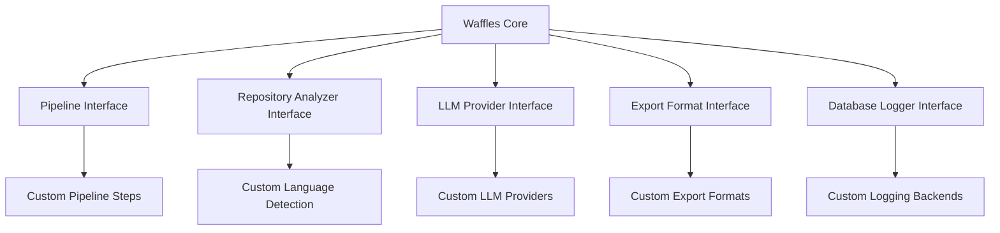

# Extensions and Customization Guide

This document explains how to extend and customize Waffles for specific use cases, including plugin development, custom integrations, and advanced configuration patterns.

## Table of Contents

- [Extension Architecture](#extension-architecture)
- [Custom Pipeline Steps](#custom-pipeline-steps)
- [LLM Provider Integration](#llm-provider-integration)
- [Repository Analyzers](#repository-analyzers)
- [Export Formats](#export-formats)
- [Database Extensions](#database-extensions)
- [Configuration Extensions](#configuration-extensions)
- [Tool Integrations](#tool-integrations)
- [Advanced Use Cases](#advanced-use-cases)
- [Plugin Development](#plugin-development)

## Extension Architecture

Waffles is designed with extensibility in mind, using interfaces and dependency injection to allow custom implementations of core components.

### Core Extension Points



### Plugin System

Waffles uses Go's plugin system for runtime extensibility:

```go
// pkg/plugins/interface.go
package plugins

// Plugin defines the interface all plugins must implement
type Plugin interface {
    Name() string
    Version() string
    Initialize(config map[string]interface{}) error
    Shutdown() error
}

// PipelinePlugin extends the pipeline functionality
type PipelinePlugin interface {
    Plugin
    ProcessStep(ctx context.Context, input *StepInput) (*StepOutput, error)
}

// AnalyzerPlugin extends repository analysis
type AnalyzerPlugin interface {
    Plugin
    AnalyzeFile(file *FileInfo) (*FileAnalysis, error)
    GetLanguagePatterns() map[string][]string
}
```

## Custom Pipeline Steps

### Creating Custom Steps

```go
// examples/custom_step.go
package main

import (
    "context"
    "fmt"
    
    "github.com/toozej/waffles/pkg/pipeline"
)

// CustomStep implements a custom pipeline step
type CustomStep struct {
    name   string
    config map[string]interface{}
}

func (s *CustomStep) Execute(ctx context.Context, input *pipeline.StepInput) (*pipeline.StepOutput, error) {
    // Custom processing logic
    processed := fmt.Sprintf("Processed: %s", input.Data)
    
    return &pipeline.StepOutput{
        Data:     processed,
        Metadata: map[string]interface{}{
            "processor": s.name,
            "timestamp": time.Now(),
        },
    }, nil
}

func (s *CustomStep) Name() string {
    return s.name
}

func (s *CustomStep) Validate() error {
    // Validation logic
    return nil
}

// Register the custom step
func init() {
    pipeline.RegisterStep("custom_processor", func(config map[string]interface{}) pipeline.Step {
        return &CustomStep{
            name:   "custom_processor",
            config: config,
        }
    })
}
```

### Pipeline Step Configuration

```yaml
# config/pipeline_steps.yml
steps:
  - name: "repository_analysis"
    type: "wheresmyprompt"
    config:
      include_patterns:
        - "*.go"
        - "*.js"
        - "*.py"
      exclude_patterns:
        - "vendor/*"
        - "node_modules/*"
  
  - name: "custom_processor"
    type: "custom_processor"
    config:
      processing_mode: "enhanced"
      custom_options:
        feature_a: true
        feature_b: "advanced"
  
  - name: "llm_query"
    type: "llm"
    config:
      model: "gpt-4"
      temperature: 0.7
      max_tokens: 2048
```

### Dynamic Step Loading

```go
// pkg/pipeline/dynamic.go
package pipeline

import (
    "fmt"
    "plugin"
)

// DynamicPipeline supports loading custom steps at runtime
type DynamicPipeline struct {
    *Pipeline
    stepPlugins map[string]*plugin.Plugin
}

func NewDynamicPipeline(cfg *config.Config) *DynamicPipeline {
    return &DynamicPipeline{
        Pipeline:    NewPipeline(cfg),
        stepPlugins: make(map[string]*plugin.Plugin),
    }
}

func (dp *DynamicPipeline) LoadStepPlugin(path string) error {
    p, err := plugin.Open(path)
    if err != nil {
        return fmt.Errorf("failed to load plugin %s: %w", path, err)
    }

    // Get the plugin constructor
    symbol, err := p.Lookup("NewStep")
    if err != nil {
        return fmt.Errorf("plugin %s missing NewStep function: %w", path, err)
    }

    constructor, ok := symbol.(func(config map[string]interface{}) Step)
    if !ok {
        return fmt.Errorf("invalid NewStep function signature in %s", path)
    }

    // Register the step
    step := constructor(nil)
    dp.RegisterStep(step.Name(), constructor)
    dp.stepPlugins[step.Name()] = p

    return nil
}
```

## LLM Provider Integration

### Custom LLM Provider

```go
// pkg/llm/custom_provider.go
package llm

import (
    "context"
    "encoding/json"
    "fmt"
    "net/http"
    "strings"
)

// CustomProvider implements a custom LLM provider
type CustomProvider struct {
    name       string
    baseURL    string
    apiKey     string
    httpClient *http.Client
}

func NewCustomProvider(config map[string]interface{}) Provider {
    return &CustomProvider{
        name:    config["name"].(string),
        baseURL: config["base_url"].(string),
        apiKey:  config["api_key"].(string),
        httpClient: &http.Client{
            Timeout: 30 * time.Second,
        },
    }
}

func (p *CustomProvider) Query(ctx context.Context, prompt string, options *QueryOptions) (*QueryResponse, error) {
    request := map[string]interface{}{
        "prompt":      prompt,
        "model":       options.Model,
        "temperature": options.Temperature,
        "max_tokens":  options.MaxTokens,
    }

    response, err := p.makeRequest(ctx, "/v1/completions", request)
    if err != nil {
        return nil, fmt.Errorf("custom provider query failed: %w", err)
    }

    return &QueryResponse{
        Content: response["text"].(string),
        Model:   options.Model,
        Usage: Usage{
            PromptTokens:     int(response["prompt_tokens"].(float64)),
            CompletionTokens: int(response["completion_tokens"].(float64)),
        },
    }, nil
}

func (p *CustomProvider) makeRequest(ctx context.Context, endpoint string, data map[string]interface{}) (map[string]interface{}, error) {
    jsonData, err := json.Marshal(data)
    if err != nil {
        return nil, err
    }

    req, err := http.NewRequestWithContext(ctx, "POST", p.baseURL+endpoint, strings.NewReader(string(jsonData)))
    if err != nil {
        return nil, err
    }

    req.Header.Set("Content-Type", "application/json")
    req.Header.Set("Authorization", "Bearer "+p.apiKey)

    resp, err := p.httpClient.Do(req)
    if err != nil {
        return nil, err
    }
    defer resp.Body.Close()

    var result map[string]interface{}
    if err := json.NewDecoder(resp.Body).Decode(&result); err != nil {
        return nil, err
    }

    return result, nil
}

// Register the provider
func init() {
    RegisterProvider("custom", NewCustomProvider)
}
```

### Provider Configuration

```go
// pkg/llm/registry.go
package llm

var providers = make(map[string]ProviderConstructor)

type ProviderConstructor func(config map[string]interface{}) Provider

func RegisterProvider(name string, constructor ProviderConstructor) {
    providers[name] = constructor
}

func GetProvider(name string, config map[string]interface{}) (Provider, error) {
    constructor, exists := providers[name]
    if !exists {
        return nil, fmt.Errorf("unknown provider: %s", name)
    }
    return constructor(config), nil
}

// Provider configurations
type ProviderConfig struct {
    Name    string                 `json:"name"`
    Type    string                 `json:"type"`
    Config  map[string]interface{} `json:"config"`
    Default bool                   `json:"default,omitempty"`
}

func LoadProviders(configPath string) ([]ProviderConfig, error) {
    data, err := os.ReadFile(configPath)
    if err != nil {
        return nil, err
    }

    var configs []ProviderConfig
    if err := json.Unmarshal(data, &configs); err != nil {
        return nil, err
    }

    return configs, nil
}
```

## Repository Analyzers

### Custom Language Detection

```go
// pkg/repo/custom_analyzer.go
package repo

import (
    "bufio"
    "os"
    "path/filepath"
    "strings"
)

// CustomAnalyzer extends the default repository analyzer
type CustomAnalyzer struct {
    *Analyzer
    customPatterns map[string][]string
    contentRules   map[string]func(string) bool
}

func NewCustomAnalyzer(cfg *config.Config) *CustomAnalyzer {
    return &CustomAnalyzer{
        Analyzer: NewAnalyzer(cfg),
        customPatterns: map[string][]string{
            "dockerfile": {"Dockerfile*", "*.dockerfile"},
            "terraform":  {"*.tf", "*.tfvars"},
            "ansible":    {"*.yml", "*.yaml"}, // With content detection
        },
        contentRules: map[string]func(string) bool{
            "ansible": isAnsiblePlaybook,
            "docker-compose": isDockerCompose,
        },
    }
}

func (ca *CustomAnalyzer) DetectLanguage(filename string) string {
    // Try standard detection first
    if lang := ca.Analyzer.DetectLanguage(filename); lang != "unknown" {
        return lang
    }

    // Try custom pattern matching
    ext := strings.ToLower(filepath.Ext(filename))
    base := strings.ToLower(filepath.Base(filename))

    for language, patterns := range ca.customPatterns {
        for _, pattern := range patterns {
            if matched, _ := filepath.Match(pattern, base); matched {
                // Use content-based validation if available
                if validator, exists := ca.contentRules[language]; exists {
                    if content := readFilePreview(filename, 100); validator(content) {
                        return language
                    }
                } else {
                    return language
                }
            }
        }
    }

    return "unknown"
}

func isAnsiblePlaybook(content string) bool {
    lines := strings.Split(content, "\n")
    for _, line := range lines {
        line = strings.TrimSpace(line)
        if strings.Contains(line, "hosts:") ||
           strings.Contains(line, "tasks:") ||
           strings.Contains(line, "playbook") {
            return true
        }
    }
    return false
}

func isDockerCompose(content string) bool {
    return strings.Contains(content, "version:") &&
           (strings.Contains(content, "services:") ||
            strings.Contains(content, "volumes:") ||
            strings.Contains(content, "networks:"))
}

func readFilePreview(filename string, lines int) string {
    file, err := os.Open(filename)
    if err != nil {
        return ""
    }
    defer file.Close()

    scanner := bufio.NewScanner(file)
    var result strings.Builder
    lineCount := 0

    for scanner.Scan() && lineCount < lines {
        result.WriteString(scanner.Text())
        result.WriteString("\n")
        lineCount++
    }

    return result.String()
}
```

### Framework Detection

```go
// pkg/repo/framework_detector.go
package repo

import (
    "encoding/json"
    "os"
    "path/filepath"
)

type Framework struct {
    Name         string   `json:"name"`
    Version      string   `json:"version,omitempty"`
    Language     string   `json:"language"`
    ConfigFiles  []string `json:"config_files"`
    Dependencies []string `json:"dependencies,omitempty"`
}

type FrameworkDetector struct {
    patterns map[string]FrameworkPattern
}

type FrameworkPattern struct {
    Name        string
    Language    string
    Files       []string
    Contents    map[string][]string  // file -> required content patterns
    PackageFile string               // package.json, requirements.txt, etc.
    Dependencies []string           // dependency names to look for
}

func NewFrameworkDetector() *FrameworkDetector {
    return &FrameworkDetector{
        patterns: map[string]FrameworkPattern{
            "react": {
                Name:        "React",
                Language:    "javascript",
                Files:       []string{"package.json"},
                PackageFile: "package.json",
                Dependencies: []string{"react", "react-dom"},
            },
            "nextjs": {
                Name:        "Next.js",
                Language:    "javascript",
                Files:       []string{"next.config.js", "next.config.ts", "package.json"},
                PackageFile: "package.json",
                Dependencies: []string{"next"},
            },
            "django": {
                Name:        "Django",
                Language:    "python",
                Files:       []string{"manage.py", "settings.py"},
                PackageFile: "requirements.txt",
                Dependencies: []string{"Django"},
            },
            "gin": {
                Name:     "Gin",
                Language: "go",
                Files:    []string{"go.mod"},
                Contents: map[string][]string{
                    "go.mod": {"github.com/gin-gonic/gin"},
                },
            },
        },
    }
}

func (fd *FrameworkDetector) DetectFrameworks(repoPath string) ([]Framework, error) {
    var frameworks []Framework

    for _, pattern := range fd.patterns {
        if framework, detected := fd.detectFramework(repoPath, pattern); detected {
            frameworks = append(frameworks, framework)
        }
    }

    return frameworks, nil
}

func (fd *FrameworkDetector) detectFramework(repoPath string, pattern FrameworkPattern) (Framework, bool) {
    // Check for required files
    for _, file := range pattern.Files {
        filePath := filepath.Join(repoPath, file)
        if _, err := os.Stat(filePath); err != nil {
            continue // File not found, try next pattern
        }

        // Check file contents if specified
        if contents, exists := pattern.Contents[file]; exists {
            if !fd.checkFileContents(filePath, contents) {
                continue
            }
        }

        // Check dependencies in package file
        if pattern.PackageFile != "" && pattern.Dependencies != nil {
            packagePath := filepath.Join(repoPath, pattern.PackageFile)
            if !fd.checkDependencies(packagePath, pattern.Dependencies) {
                continue
            }
        }

        // Framework detected
        framework := Framework{
            Name:        pattern.Name,
            Language:    pattern.Language,
            ConfigFiles: pattern.Files,
        }

        // Try to extract version
        if pattern.PackageFile != "" {
            if version := fd.extractVersion(filepath.Join(repoPath, pattern.PackageFile), pattern.Dependencies[0]); version != "" {
                framework.Version = version
            }
        }

        return framework, true
    }

    return Framework{}, false
}

func (fd *FrameworkDetector) checkFileContents(filePath string, requiredContents []string) bool {
    content, err := os.ReadFile(filePath)
    if err != nil {
        return false
    }

    contentStr := string(content)
    for _, required := range requiredContents {
        if !strings.Contains(contentStr, required) {
            return false
        }
    }

    return true
}

func (fd *FrameworkDetector) checkDependencies(packagePath string, dependencies []string) bool {
    switch filepath.Ext(packagePath) {
    case ".json":
        return fd.checkJSONDependencies(packagePath, dependencies)
    case ".txt":
        return fd.checkTextDependencies(packagePath, dependencies)
    default:
        return false
    }
}

func (fd *FrameworkDetector) checkJSONDependencies(packagePath string, dependencies []string) bool {
    data, err := os.ReadFile(packagePath)
    if err != nil {
        return false
    }

    var pkg map[string]interface{}
    if err := json.Unmarshal(data, &pkg); err != nil {
        return false
    }

    // Check both dependencies and devDependencies
    deps := []string{"dependencies", "devDependencies"}
    for _, depType := range deps {
        if depMap, exists := pkg[depType].(map[string]interface{}); exists {
            for _, dep := range dependencies {
                if _, found := depMap[dep]; found {
                    return true
                }
            }
        }
    }

    return false
}
```

## Export Formats

### Custom Export Format

```go
// pkg/export/custom_format.go
package export

import (
    "encoding/xml"
    "fmt"
    "io"
    "time"
)

// XMLExporter implements XML export format
type XMLExporter struct {
    writer  io.Writer
    options *ExportOptions
}

type XMLReport struct {
    XMLName    xml.Name        `xml:"waffles-report"`
    Timestamp  string          `xml:"timestamp,attr"`
    Version    string          `xml:"version,attr"`
    Executions []XMLExecution `xml:"executions>execution"`
}

type XMLExecution struct {
    ID       string     `xml:"id,attr"`
    Query    string     `xml:"query"`
    Success  bool       `xml:"success,attr"`
    Duration int64      `xml:"duration-ms,attr"`
    Steps    []XMLStep  `xml:"steps>step"`
    Error    string     `xml:"error,omitempty"`
}

type XMLStep struct {
    Name     string `xml:"name,attr"`
    Success  bool   `xml:"success,attr"`
    Duration int64  `xml:"duration-ms,attr"`
    Input    string `xml:"input,omitempty"`
    Output   string `xml:"output,omitempty"`
    Error    string `xml:"error,omitempty"`
}

func NewXMLExporter(writer io.Writer, options *ExportOptions) Exporter {
    return &XMLExporter{
        writer:  writer,
        options: options,
    }
}

func (e *XMLExporter) Export(data []ExecutionLog) error {
    report := XMLReport{
        Timestamp: time.Now().Format(time.RFC3339),
        Version:   "1.0",
    }

    for _, exec := range data {
        xmlExec := XMLExecution{
            ID:       exec.ExecutionID,
            Query:    exec.Query,
            Success:  exec.Success,
            Duration: exec.Duration,
            Error:    exec.Error,
        }

        // Add steps if available
        if steps, err := e.getExecutionSteps(exec.ExecutionID); err == nil {
            for _, step := range steps {
                xmlExec.Steps = append(xmlExec.Steps, XMLStep{
                    Name:     step.StepName,
                    Success:  step.Success,
                    Duration: step.Duration,
                    Input:    truncateString(step.Input, 1000),
                    Output:   truncateString(step.Output, 1000),
                    Error:    step.Error,
                })
            }
        }

        report.Executions = append(report.Executions, xmlExec)
    }

    encoder := xml.NewEncoder(e.writer)
    encoder.Indent("", "  ")

    if _, err := e.writer.Write([]byte(xml.Header)); err != nil {
        return fmt.Errorf("failed to write XML header: %w", err)
    }

    if err := encoder.Encode(report); err != nil {
        return fmt.Errorf("failed to encode XML: %w", err)
    }

    return nil
}

func (e *XMLExporter) getExecutionSteps(executionID string) ([]StepLog, error) {
    // Implementation to fetch steps from database
    // This would be injected via dependency injection in practice
    return nil, nil
}

// Register the format
func init() {
    RegisterExporter("xml", func(writer io.Writer, options *ExportOptions) Exporter {
        return NewXMLExporter(writer, options)
    })
}
```

### Template-Based Export

```go
// pkg/export/template_exporter.go
package export

import (
    "fmt"
    "html/template"
    "io"
    "path/filepath"
)

// TemplateExporter uses Go templates for flexible export formatting
type TemplateExporter struct {
    writer   io.Writer
    template *template.Template
    options  *ExportOptions
}

func NewTemplateExporter(writer io.Writer, templatePath string, options *ExportOptions) (Exporter, error) {
    tmpl, err := template.ParseFiles(templatePath)
    if err != nil {
        return nil, fmt.Errorf("failed to parse template: %w", err)
    }

    return &TemplateExporter{
        writer:   writer,
        template: tmpl,
        options:  options,
    }, nil
}

func (e *TemplateExporter) Export(data []ExecutionLog) error {
    templateData := struct {
        Executions []ExecutionLog
        Options    *ExportOptions
        Generated  string
    }{
        Executions: data,
        Options:    e.options,
        Generated:  time.Now().Format(time.RFC3339),
    }

    if err := e.template.Execute(e.writer, templateData); err != nil {
        return fmt.Errorf("template execution failed: %w", err)
    }

    return nil
}

// Template registry for common formats
var templates = map[string]string{
    "html": `
<!DOCTYPE html>
<html>
<head>
    <title>Waffles Execution Report</title>
    <style>
        body { font-family: Arial, sans-serif; }
        .execution { border: 1px solid #ddd; margin: 10px 0; padding: 15px; }
        .success { border-left: 5px solid #4CAF50; }
        .error { border-left: 5px solid #f44336; }
        .metadata { background: #f5f5f5; padding: 10px; margin-top: 10px; }
    </style>
</head>
<body>
    <h1>Waffles Execution Report</h1>
    <p>Generated: {{.Generated}}</p>
    <p>Total Executions: {{len .Executions}}</p>
    
    {{range .Executions}}
    <div class="execution {{if .Success}}success{{else}}error{{end}}">
        <h3>{{.Query}}</h3>
        <div class="metadata">
            <strong>ID:</strong> {{.ExecutionID}}<br>
            <strong>Duration:</strong> {{.Duration}}ms<br>
            <strong>Success:</strong> {{.Success}}<br>
            {{if .Error}}<strong>Error:</strong> {{.Error}}<br>{{end}}
            <strong>Created:</strong> {{.CreatedAt.Format "2006-01-02 15:04:05"}}
        </div>
    </div>
    {{end}}
</body>
</html>`,
    "markdown": `# Waffles Execution Report

**Generated:** {{.Generated}}  
**Total Executions:** {{len .Executions}}

{{range .Executions}}
## {{.Query}}

- **ID:** {{.ExecutionID}}
- **Duration:** {{.Duration}}ms  
- **Success:** {{.Success}}
{{if .Error}}
- **Error:** {{.Error}}
{{end}}
- **Created:** {{.CreatedAt.Format "2006-01-02 15:04:05"}}

---
{{end}}`,
}

func GetBuiltinTemplate(format string) (string, error) {
    tmpl, exists := templates[format]
    if !exists {
        return "", fmt.Errorf("unknown template format: %s", format)
    }
    return tmpl, nil
}
```

## Database Extensions

### Custom Logging Backend

```go
// pkg/logging/extensions.go
package logging

import (
    "context"
    "fmt"
    "time"
)

// LoggerBackend defines interface for custom logging backends
type LoggerBackend interface {
    LogExecution(ctx context.Context, execution *ExecutionLog) error
    LogStep(ctx context.Context, step *StepLog) error
    GetExecutions(ctx context.Context, limit, offset int) ([]ExecutionLog, error)
    Query(ctx context.Context, query string, params ...interface{}) ([]map[string]interface{}, error)
    Close() error
}

// ElasticsearchBackend implements logging to Elasticsearch
type ElasticsearchBackend struct {
    client     *elasticsearch.Client
    indexName  string
}

func NewElasticsearchBackend(url, indexName string) (*ElasticsearchBackend, error) {
    cfg := elasticsearch.Config{
        Addresses: []string{url},
    }
    
    client, err := elasticsearch.NewClient(cfg)
    if err != nil {
        return nil, fmt.Errorf("failed to create Elasticsearch client: %w", err)
    }

    return &ElasticsearchBackend{
        client:    client,
        indexName: indexName,
    }, nil
}

func (e *ElasticsearchBackend) LogExecution(ctx context.Context, execution *ExecutionLog) error {
    doc := map[string]interface{}{
        "execution_id": execution.ExecutionID,
        "query":        execution.Query,
        "success":      execution.Success,
        "duration_ms":  execution.Duration,
        "error":        execution.Error,
        "timestamp":    execution.CreatedAt,
        "metadata":     execution.Metadata,
    }

    docJSON, err := json.Marshal(doc)
    if err != nil {
        return err
    }

    req := esapi.IndexRequest{
        Index:      e.indexName,
        DocumentID: execution.ExecutionID,
        Body:       strings.NewReader(string(docJSON)),
        Refresh:    "true",
    }

    res, err := req.Do(ctx, e.client)
    if err != nil {
        return fmt.Errorf("elasticsearch indexing failed: %w", err)
    }
    defer res.Body.Close()

    if res.IsError() {
        return fmt.Errorf("elasticsearch returned error: %s", res.Status())
    }

    return nil
}

// Multi-backend logger that can write to multiple destinations
type MultiBackendLogger struct {
    backends []LoggerBackend
    primary  LoggerBackend  // Primary backend for reads
}

func NewMultiBackendLogger(primary LoggerBackend, additional ...LoggerBackend) *MultiBackendLogger {
    return &MultiBackendLogger{
        backends: append([]LoggerBackend{primary}, additional...),
        primary:  primary,
    }
}

func (m *MultiBackendLogger) LogExecution(ctx context.Context, execution *ExecutionLog) error {
    var firstError error
    
    for i, backend := range m.backends {
        if err := backend.LogExecution(ctx, execution); err != nil {
            if i == 0 { // Primary backend
                firstError = err
            }
            // Log error but continue with other backends
            fmt.Printf("Backend %T failed to log execution: %v\n", backend, err)
        }
    }
    
    return firstError // Return error only if primary backend fails
}
```

## Configuration Extensions

### Environment-Specific Configurations

```go
// pkg/config/environments.go
package config

import (
    "fmt"
    "os"
    "path/filepath"
)

type Environment string

const (
    Development Environment = "development"
    Staging     Environment = "staging"
    Production  Environment = "production"
)

type EnvironmentConfig struct {
    Base        *Config               `yaml:"base"`
    Environments map[string]*Config   `yaml:"environments"`
}

func LoadEnvironmentConfig(configDir string) (*Config, error) {
    env := Environment(os.Getenv("WAFFLES_ENV"))
    if env == "" {
        env = Development
    }

    // Load base configuration
    basePath := filepath.Join(configDir, "base.yml")
    baseConfig, err := LoadConfigFromYAML(basePath)
    if err != nil {
        return nil, fmt.Errorf("failed to load base config: %w", err)
    }

    // Load environment-specific overrides
    envPath := filepath.Join(configDir, fmt.Sprintf("%s.yml", env))
    if _, err := os.Stat(envPath); err == nil {
        envConfig, err := LoadConfigFromYAML(envPath)
        if err != nil {
            return nil, fmt.Errorf("failed to load %s config: %w", env, err)
        }

        // Merge configurations
        return mergeConfigs(baseConfig, envConfig), nil
    }

    return baseConfig, nil
}

func mergeConfigs(base, override *Config) *Config {
    result := *base

    if override.DefaultModel != "" {
        result.DefaultModel = override.DefaultModel
    }
    if override.DefaultProvider != "" {
        result.DefaultProvider = override.DefaultProvider
    }
    if override.Timeout != 0 {
        result.Timeout = override.Timeout
    }
    // ... merge other fields

    return &result
}

// Feature flags for gradual rollouts
type FeatureFlags struct {
    EnableNewPipeline    bool `env:"WAFFLES_FEATURE_NEW_PIPELINE"`
    EnableAdvancedAnalysis bool `env:"WAFFLES_FEATURE_ADVANCED_ANALYSIS"`
    EnableExperimentalLLM bool `env:"WAFFLES_FEATURE_EXPERIMENTAL_LLM"`
}

func (c *Config) GetFeatureFlags() *FeatureFlags {
    return &FeatureFlags{
        EnableNewPipeline:      getBoolEnv("WAFFLES_FEATURE_NEW_PIPELINE", false),
        EnableAdvancedAnalysis: getBoolEnv("WAFFLES_FEATURE_ADVANCED_ANALYSIS", false),
        EnableExperimentalLLM:  getBoolEnv("WAFFLES_FEATURE_EXPERIMENTAL_LLM", false),
    }
}
```

## Tool Integrations

### Custom Tool Integration

```go
// pkg/tools/custom_tool.go
package tools

import (
    "context"
    "os/exec"
    "strings"
    "time"
)

// CustomTool wraps external tools for pipeline integration
type CustomTool struct {
    name       string
    command    string
    args       []string
    timeout    time.Duration
    validator  func(string) error
}

type ToolConfig struct {
    Name     string            `json:"name"`
    Command  string            `json:"command"`
    Args     []string          `json:"args"`
    Timeout  string            `json:"timeout"`
    Env      map[string]string `json:"env"`
}

func NewCustomTool(config *ToolConfig) (*CustomTool, error) {
    timeout := 30 * time.Second
    if config.Timeout != "" {
        if t, err := time.ParseDuration(config.Timeout); err == nil {
            timeout = t
        }
    }

    return &CustomTool{
        name:    config.Name,
        command: config.Command,
        args:    config.Args,
        timeout: timeout,
    }, nil
}

func (t *CustomTool) Execute(ctx context.Context, input string) (string, error) {
    ctx, cancel := context.WithTimeout(ctx, t.timeout)
    defer cancel()

    // Replace placeholders in arguments
    args := make([]string, len(t.args))
    for i, arg := range t.args {
        args[i] = strings.ReplaceAll(arg, "{input}", input)
    }

    cmd := exec.CommandContext(ctx, t.command, args...)
    cmd.Stdin = strings.NewReader(input)

    output, err := cmd.CombinedOutput()
    if err != nil {
        return "", fmt.Errorf("tool %s execution failed: %w", t.name, err)
    }

    result := string(output)
    
    // Validate output if validator is set
    if t.validator != nil {
        if err := t.validator(result); err != nil {
            return "", fmt.Errorf("tool %s output validation failed: %w", t.name, err)
        }
    }

    return result, nil
}

// Tool registry for dynamic tool loading
type ToolRegistry struct {
    tools map[string]*CustomTool
}

func NewToolRegistry() *ToolRegistry {
    return &ToolRegistry{
        tools: make(map[string]*CustomTool),
    }
}

func (r *ToolRegistry) RegisterTool(tool *CustomTool) {
    r.tools[tool.name] = tool
}

func (r *ToolRegistry) GetTool(name string) (*CustomTool, bool) {
    tool, exists := r.tools[name]
    return tool, exists
}

func (r *ToolRegistry) LoadFromConfig(configPath string) error {
    var configs []ToolConfig
    data, err := os.ReadFile(configPath)
    if err != nil {
        return err
    }

    if err := json.Unmarshal(data, &configs); err != nil {
        return err
    }

    for _, config := range configs {
        tool, err := NewCustomTool(&config)
        if err != nil {
            return fmt.Errorf("failed to create tool %s: %w", config.Name, err)
        }
        r.RegisterTool(tool)
    }

    return nil
}
```

## Advanced Use Cases

### Workflow Orchestration

```go
// pkg/workflow/orchestrator.go
package workflow

import (
    "context"
    "fmt"
    "sync"
)

// WorkflowStep represents a single step in a workflow
type WorkflowStep struct {
    Name         string                 `json:"name"`
    Type         string                 `json:"type"`
    Dependencies []string               `json:"dependencies"`
    Config       map[string]interface{} `json:"config"`
    Parallel     bool                   `json:"parallel"`
}

// Workflow defines a complete workflow
type Workflow struct {
    Name        string                 `json:"name"`
    Description string                 `json:"description"`
    Steps       []WorkflowStep         `json:"steps"`
    Variables   map[string]interface{} `json:"variables"`
}

// WorkflowExecutor executes workflows with dependency resolution
type WorkflowExecutor struct {
    pipeline   *pipeline.Pipeline
    tools      map[string]Tool
    stepStates map[string]*StepState
    mutex      sync.RWMutex
}

type StepState struct {
    Status    string
    Output    string
    Error     error
    StartTime time.Time
    EndTime   time.Time
}

func NewWorkflowExecutor(pipeline *pipeline.Pipeline) *WorkflowExecutor {
    return &WorkflowExecutor{
        pipeline:   pipeline,
        tools:      make(map[string]Tool),
        stepStates: make(map[string]*StepState),
    }
}

func (we *WorkflowExecutor) ExecuteWorkflow(ctx context.Context, workflow *Workflow) error {
    // Build dependency graph
    graph := we.buildDependencyGraph(workflow.Steps)
    
    // Execute steps in topological order
    return we.executeDAG(ctx, graph, workflow.Variables)
}

func (we *WorkflowExecutor) buildDependencyGraph(steps []WorkflowStep) map[string][]string {
    graph := make(map[string][]string)
    
    for _, step := range steps {
        graph[step.Name] = step.Dependencies
    }
    
    return graph
}

func (we *WorkflowExecutor) executeDAG(ctx context.Context, graph map[string][]string, variables map[string]interface{}) error {
    completed := make(map[string]bool)
    var wg sync.WaitGroup
    
    for len(completed) < len(graph) {
        ready := we.findReadySteps(graph, completed)
        if len(ready) == 0 {
            return fmt.Errorf("circular dependency detected or no ready steps")
        }
        
        // Execute ready steps in parallel
        for _, stepName := range ready {
            wg.Add(1)
            go func(name string) {
                defer wg.Done()
                
                if err := we.executeStep(ctx, name, variables); err != nil {
                    // Handle step failure
                    we.setStepState(name, &StepState{
                        Status: "failed",
                        Error:  err,
                    })
                } else {
                    completed[name] = true
                    we.setStepState(name, &StepState{
                        Status: "completed",
                    })
                }
            }(stepName)
        }
        
        wg.Wait()
    }
    
    return nil
}

func (we *WorkflowExecutor) findReadySteps(graph map[string][]string, completed map[string]bool) []string {
    var ready []string
    
    for stepName, dependencies := range graph {
        if completed[stepName] {
            continue
        }
        
        allDepsComplete := true
        for _, dep := range dependencies {
            if !completed[dep] {
                allDepsComplete = false
                break
            }
        }
        
        if allDepsComplete {
            ready = append(ready, stepName)
        }
    }
    
    return ready
}
```

### Multi-Repository Analysis

```go
// pkg/multi/analyzer.go
package multi

import (
    "context"
    "fmt"
    "path/filepath"
    "sync"
)

// MultiRepoAnalyzer analyzes multiple repositories concurrently
type MultiRepoAnalyzer struct {
    analyzer   *repo.Analyzer
    maxWorkers int
}

type RepoAnalysisResult struct {
    Path   string              `json:"path"`
    Info   *repo.RepositoryInfo `json:"info,omitempty"`
    Error  string              `json:"error,omitempty"`
}

type MultiRepoReport struct {
    TotalRepos     int                    `json:"total_repos"`
    SuccessfulRepos int                   `json:"successful_repos"`
    FailedRepos    int                    `json:"failed_repos"`
    Results        []RepoAnalysisResult   `json:"results"`
    Summary        *AnalysisSummary       `json:"summary"`
}

type AnalysisSummary struct {
    Languages      map[string]int `json:"languages"`
    Frameworks     map[string]int `json:"frameworks"`
    TotalFiles     int64          `json:"total_files"`
    TotalSize      int64          `json:"total_size"`
}

func NewMultiRepoAnalyzer(analyzer *repo.Analyzer, maxWorkers int) *MultiRepoAnalyzer {
    if maxWorkers <= 0 {
        maxWorkers = 10
    }
    
    return &MultiRepoAnalyzer{
        analyzer:   analyzer,
        maxWorkers: maxWorkers,
    }
}

func (mra *MultiRepoAnalyzer) AnalyzeRepositories(ctx context.Context, repoPaths []string) (*MultiRepoReport, error) {
    results := make([]RepoAnalysisResult, len(repoPaths))
    
    // Create worker pool
    jobs := make(chan int, len(repoPaths))
    var wg sync.WaitGroup
    
    // Start workers
    for w := 0; w < mra.maxWorkers; w++ {
        wg.Add(1)
        go func() {
            defer wg.Done()
            
            for i := range jobs {
                select {
                case <-ctx.Done():
                    return
                default:
                    results[i] = mra.analyzeRepository(repoPaths[i])
                }
            }
        }()
    }
    
    // Send jobs
    for i := range repoPaths {
        jobs <- i
    }
    close(jobs)
    
    // Wait for completion
    wg.Wait()
    
    // Generate report
    return mra.generateReport(results), nil
}

func (mra *MultiRepoAnalyzer) analyzeRepository(repoPath string) RepoAnalysisResult {
    info, err := mra.analyzer.Analyze(repoPath)
    if err != nil {
        return RepoAnalysisResult{
            Path:  repoPath,
            Error: err.Error(),
        }
    }
    
    return RepoAnalysisResult{
        Path: repoPath,
        Info: info,
    }
}

func (mra *MultiRepoAnalyzer) generateReport(results []RepoAnalysisResult) *MultiRepoReport {
    report := &MultiRepoReport{
        TotalRepos: len(results),
        Results:    results,
        Summary: &AnalysisSummary{
            Languages:  make(map[string]int),
            Frameworks: make(map[string]int),
        },
    }
    
    for _, result := range results {
        if result.Error != "" {
            report.FailedRepos++
            continue
        }
        
        report.SuccessfulRepos++
        
        // Aggregate statistics
        if result.Info != nil {
            report.Summary.TotalFiles += int64(result.Info.FileCount)
            report.Summary.TotalSize += result.Info.TotalSize
            
            for lang, count := range result.Info.Languages {
                report.Summary.Languages[lang] += count
            }
        }
    }
    
    return report
}
```

## Plugin Development

### Plugin Interface

```go
// pkg/plugins/plugin.go
package plugins

import (
    "context"
    "fmt"
    "plugin"
    "path/filepath"
)

// Plugin is the base interface all plugins must implement
type Plugin interface {
    Name() string
    Version() string
    Description() string
    Initialize(config map[string]interface{}) error
    Shutdown() error
}

// PluginManager manages plugin lifecycle
type PluginManager struct {
    plugins     map[string]Plugin
    pluginPaths map[string]*plugin.Plugin
}

func NewPluginManager() *PluginManager {
    return &PluginManager{
        plugins:     make(map[string]Plugin),
        pluginPaths: make(map[string]*plugin.Plugin),
    }
}

func (pm *PluginManager) LoadPlugin(path string) error {
    p, err := plugin.Open(path)
    if err != nil {
        return fmt.Errorf("failed to open plugin %s: %w", path, err)
    }

    // Get plugin constructor
    symbol, err := p.Lookup("NewPlugin")
    if err != nil {
        return fmt.Errorf("plugin %s missing NewPlugin function: %w", path, err)
    }

    constructor, ok := symbol.(func() Plugin)
    if !ok {
        return fmt.Errorf("invalid NewPlugin function signature in %s", path)
    }

    // Create plugin instance
    plugin := constructor()
    
    // Initialize plugin
    if err := plugin.Initialize(nil); err != nil {
        return fmt.Errorf("plugin initialization failed: %w", err)
    }

    pm.plugins[plugin.Name()] = plugin
    pm.pluginPaths[plugin.Name()] = p

    return nil
}

func (pm *PluginManager) LoadPluginsFromDirectory(dir string) error {
    files, err := filepath.Glob(filepath.Join(dir, "*.so"))
    if err != nil {
        return err
    }

    for _, file := range files {
        if err := pm.LoadPlugin(file); err != nil {
            fmt.Printf("Failed to load plugin %s: %v\n", file, err)
        }
    }

    return nil
}

func (pm *PluginManager) GetPlugin(name string) (Plugin, bool) {
    plugin, exists := pm.plugins[name]
    return plugin, exists
}

func (pm *PluginManager) UnloadPlugin(name string) error {
    plugin, exists := pm.plugins[name]
    if !exists {
        return fmt.Errorf("plugin %s not found", name)
    }

    if err := plugin.Shutdown(); err != nil {
        return fmt.Errorf("plugin shutdown failed: %w", err)
    }

    delete(pm.plugins, name)
    delete(pm.pluginPaths, name)

    return nil
}

func (pm *PluginManager) ListPlugins() []Plugin {
    plugins := make([]Plugin, 0, len(pm.plugins))
    for _, plugin := range pm.plugins {
        plugins = append(plugins, plugin)
    }
    return plugins
}

func (pm *PluginManager) Shutdown() error {
    var errors []error
    
    for name, plugin := range pm.plugins {
        if err := plugin.Shutdown(); err != nil {
            errors = append(errors, fmt.Errorf("plugin %s shutdown failed: %w", name, err))
        }
    }
    
    if len(errors) > 0 {
        return fmt.Errorf("plugin shutdown errors: %v", errors)
    }
    
    return nil
}
```

### Example Plugin

```go
// examples/plugins/example_plugin.go
package main

import (
    "fmt"
    "log"
    
    "github.com/toozej/waffles/pkg/plugins"
)

// ExamplePlugin implements the Plugin interface
type ExamplePlugin struct {
    name        string
    version     string
    description string
    config      map[string]interface{}
}

func (p *ExamplePlugin) Name() string {
    return p.name
}

func (p *ExamplePlugin) Version() string {
    return p.version
}

func (p *ExamplePlugin) Description() string {
    return p.description
}

func (p *ExamplePlugin) Initialize(config map[string]interface{}) error {
    p.config = config
    log.Printf("ExamplePlugin initialized with config: %+v", config)
    return nil
}

func (p *ExamplePlugin) Shutdown() error {
    log.Println("ExamplePlugin shutting down")
    return nil
}

// Plugin constructor - this is the function Waffles will call
func NewPlugin() plugins.Plugin {
    return &ExamplePlugin{
        name:        "example",
        version:     "1.0.0",
        description: "Example plugin for Waffles",
    }
}

// Build command:
// go build -buildmode=plugin -o example.so example_plugin.go
```

This comprehensive extensions guide provides developers with the tools and patterns needed to extend Waffles for their specific use cases. The modular architecture and well-defined interfaces make it easy to add custom functionality while maintaining compatibility with the core system.